# [PlutoFilter](https://github.com/sammycage/plutofilter) port to rust

PlutoFilter is a zero-allocation image filter library. A Rust port of the original C library that applies fast, chainable image effects without any dynamic memory allocation. Compatible with SVG and CSS filter semantics, it makes it easy to reproduce visual effects consistently across platforms.

## Features

- [Gaussian Blur](#gaussian-blur)
- [Color Transform](#color-transform)

  - [Grayscale](#grayscale)
  - [Sepia](#sepia)
  - [Saturate](#saturate)
  - [Brightness](#brightness)
  - [Contrast](#contrast)
  - [Opacity](#opacity)
  - [Invert](#invert)
  - [Hue Rotate](#hue-rotate)

- [Blend](#blend)

  - [Normal](#blend-normal)
  - [Multiply](#blend-multiply)
  - [Screen](#blend-screen)
  - [Overlay](#blend-overlay)
  - [Darken](#blend-darken)
  - [Lighten](#blend-lighten)
  - [Color Dodge](#blend-color-dodge)
  - [Color Burn](#blend-color-burn)
  - [Hard Light](#blend-hard-light)
  - [Soft Light](#blend-soft-light)
  - [Difference](#blend-difference)
  - [Exclusion](#blend-exclusion)

- [Composite](#composite)
  - [Over](#composite-over)
  - [In](#composite-in)
  - [Out](#composite-out)
  - [Atop](#composite-atop)
  - [Arithmetic](#arithmetic)

## Roadmap

- [Morphology](https://www.w3.org/TR/SVG11/filters.html#feMorphologyElement)
- [Diffuse Lighting](https://www.w3.org/TR/SVG11/filters.html#feDiffuseLightingElement)
- [Specular Lighting](https://www.w3.org/TR/SVG11/filters.html#feSpecularLightingElement)
- [Convolve Matrix](https://www.w3.org/TR/SVG11/filters.html#feConvolveMatrixElement)
- [Displacement Map](https://www.w3.org/TR/SVG11/filters.html#feDisplacementMapElement)
- [Turbulence](https://www.w3.org/TR/SVG11/filters.html#feTurbulenceElement)

## Gaussian Blur

Applies a Gaussian blur to the input surface using separable convolution. The amount of blur is controlled by the standard deviation along the horizontal and vertical axes. A value of `0` applies no blur.

| `0x0`                                                           | `5x5`                                                           | `10x10`                                                           |
| --------------------------------------------------------------- | --------------------------------------------------------------- | ----------------------------------------------------------------- |
|  |  | 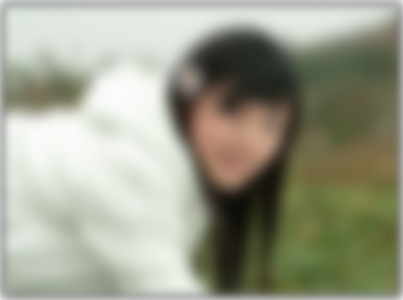 |

## Color Transform

Applies a 5×4 color transformation matrix to each pixel in the input surface. The matrix operates on color and alpha channels, allowing both isolated and cross-channel transformations. The input and output surfaces may be the same for in-place filtering.

### Example

```c
const float original[20] = {
    1.0f, 0.0f, 0.0f, 0.0f, 0.0f,
    0.0f, 1.0f, 0.0f, 0.0f, 0.0f,
    0.0f, 0.0f, 1.0f, 0.0f, 0.0f,
    0.0f, 0.0f, 0.0f, 1.0f, 0.0f
};

const float grayscale[20] = {
    0.2126f, 0.7152f, 0.0722f, 0.0f, 0.0f,
    0.2126f, 0.7152f, 0.0722f, 0.0f, 0.0f,
    0.2126f, 0.7152f, 0.0722f, 0.0f, 0.0f,
    0.0f,    0.0f,    0.0f,    1.0f, 0.0f
};

const float sepia[20] = {
    0.393f, 0.769f, 0.189f, 0.0f, 0.0f,
    0.349f, 0.686f, 0.168f, 0.0f, 0.0f,
    0.272f, 0.534f, 0.131f, 0.0f, 0.0f,
    0.0f,   0.0f,   0.0f,   1.0f, 0.0f
};

const float contrast[20] = {
    1.75f, 0.0f,  0.0f,  0.0f, -0.375f,
    0.0f,  1.75f, 0.0f,  0.0f, -0.375f,
    0.0f,  0.0f,  1.75f, 0.0f, -0.375f,
    0.0f,  0.0f,  0.0f,  1.0f,   0.0f
};
```

| `original`                                               | `grayscale`                                               | `sepia`                                               | `contrast`                                               |
| -------------------------------------------------------- | --------------------------------------------------------- | ----------------------------------------------------- | -------------------------------------------------------- |
|  |  | 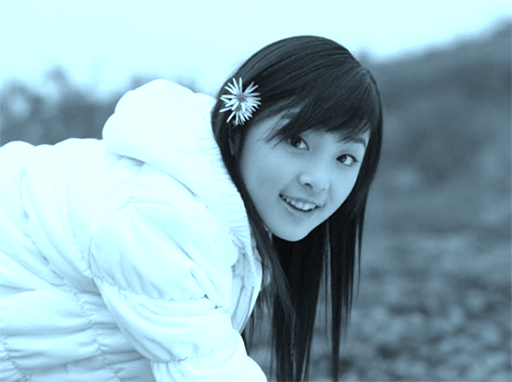 |  |

### Grayscale

Applies a grayscale effect to the input surface, controlled by a blending `amount` between the original color and fully desaturated grayscale. A value of `0` preserves the original image, while `1` results in complete grayscale.

| `0`                                                           | `0.25`                                                        | `0.5`                                                         | `0.75`                                                        | `1`                                                           |
| ------------------------------------------------------------- | ------------------------------------------------------------- | ------------------------------------------------------------- | ------------------------------------------------------------- | ------------------------------------------------------------- |
|  |  |  |  | 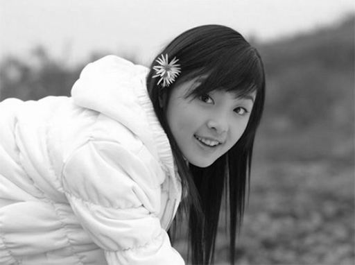 |

### Sepia

Applies a sepia tone to the input surface, blending between the original image and a warm, brownish tone. The `amount` controls the intensity, where `0` leaves the image unchanged and `1` applies full sepia coloration.

| `0`                                                       | `0.25`                                                    | `0.5`                                                     | `0.75`                                                    | `1`                                                       |
| --------------------------------------------------------- | --------------------------------------------------------- | --------------------------------------------------------- | --------------------------------------------------------- | --------------------------------------------------------- |
|  | 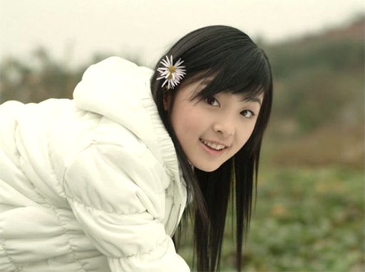 | 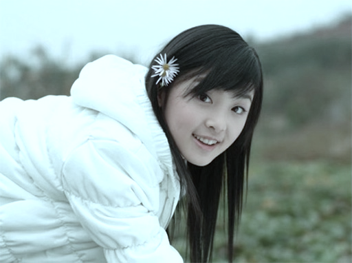 | 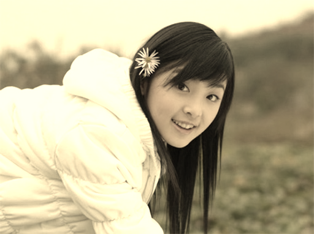 |  |

### Saturate

Adjusts the color saturation of the input surface. The `amount` controls how vivid or muted the colors become: `1` leaves the image unchanged, values less than `1` reduce saturation toward grayscale, and values greater than `1` enhance the intensity of colors.

| `0`                                                          | `0.5`                                                        | `1`                                                          | `4`                                                          |
| ------------------------------------------------------------ | ------------------------------------------------------------ | ------------------------------------------------------------ | ------------------------------------------------------------ |
|  |  |  | 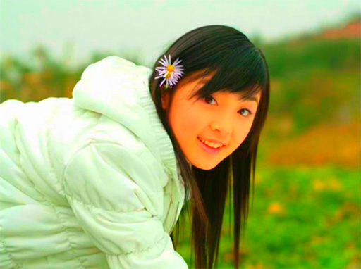 |

### Contrast

Adjusts the contrast of the input surface. An `amount` of `1` leaves the image unchanged, values below `1` reduce contrast, and values above `1` increase it. The image is scaled around the midpoint of the color range.

| `0`                                                          | `1`                                                          | `1.75`                                                       |
| ------------------------------------------------------------ | ------------------------------------------------------------ | ------------------------------------------------------------ |
|  |  |  |

### Brightness

Adjusts the brightness of the input surface. An `amount` of `1` preserves the original brightness, values below `1` darken the image, and values above `1` brighten it uniformly across all color channels.

| `0`                                                            | `0.5`                                                          | `1`                                                            | `1.75`                                                         |
| -------------------------------------------------------------- | -------------------------------------------------------------- | -------------------------------------------------------------- | -------------------------------------------------------------- |
|  | 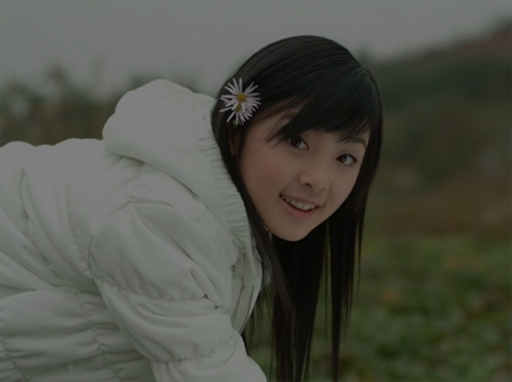 |  | 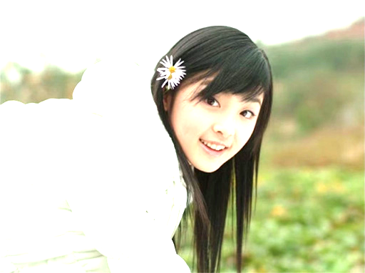 |

### Opacity

Adjusts the opacity (alpha) of the input surface. An `amount` of `1` leaves opacity unchanged, while values between `0` and `1` scale the alpha channel linearly. A value of `0` makes the image fully transparent.

| `0`                                                         | `0.25`                                                      | `0.5`                                                       | `0.75`                                                      | `1`                                                         |
| ----------------------------------------------------------- | ----------------------------------------------------------- | ----------------------------------------------------------- | ----------------------------------------------------------- | ----------------------------------------------------------- |
|  |  |  |  |  |

### Invert

Applies a color inversion effect to the input surface. The `amount` controls the strength of the inversion: `0` leaves the image unchanged, `1` fully inverts the RGB channels, and intermediate values blend between the original and inverted colors.

| `0`                                                        | `0.25`                                                     | `0.5`                                                      | `0.75`                                                     | `1`                                                        |
| ---------------------------------------------------------- | ---------------------------------------------------------- | ---------------------------------------------------------- | ---------------------------------------------------------- | ---------------------------------------------------------- |
|  | 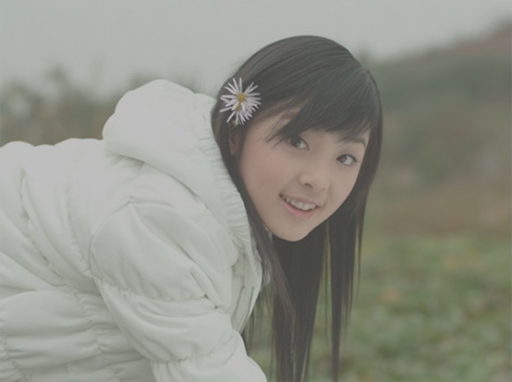 |  | 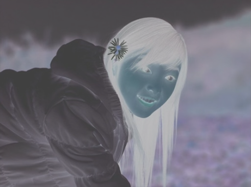 |  |

### Hue Rotate

Rotates the hue of each pixel in the input surface by the given angle in degrees. The rotation is applied in the RGB color space, preserving luminance and alpha. A value of `0` leaves colors unchanged, while `360` completes a full rotation back to the original.

| `0°`                                                           | `30°`                                                          | `90°`                                                          | `180°`                                                         | `270°`                                                         | `360°`                                                         |
| -------------------------------------------------------------- | -------------------------------------------------------------- | -------------------------------------------------------------- | -------------------------------------------------------------- | -------------------------------------------------------------- | -------------------------------------------------------------- |
|  | 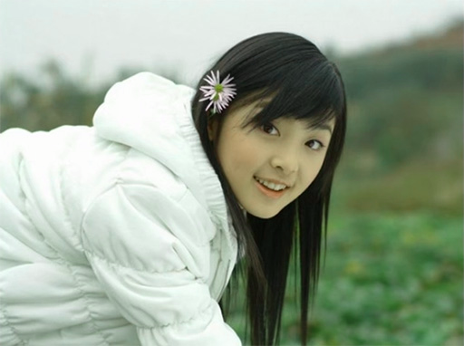 | 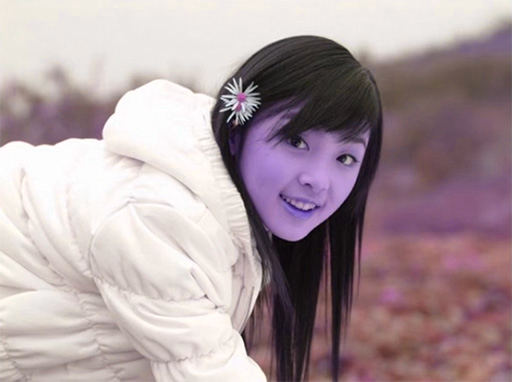 | 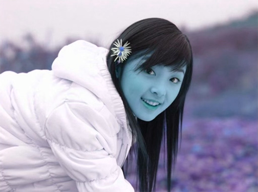 | 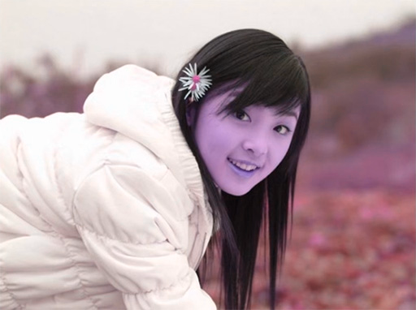 | 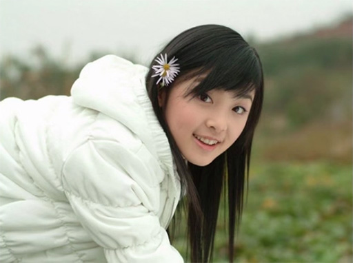 |

## Blend

Blends two surfaces using the specified blend mode. The source surface is blended over the backdrop, and the result is written to the output.

### <a id="blend-normal"></a>Normal

Displays the source over the backdrop using standard alpha compositing.


### <a id="blend-multiply"></a>Multiply

Multiplies the colors of the source and backdrop, resulting in a darker image.


### <a id="blend-screen"></a>Screen

Brightens the result by inverting, multiplying, and inverting again.

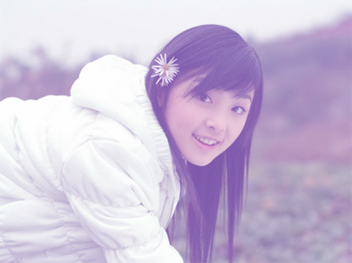

### <a id="blend-overlay"></a>Overlay

Applies Multiply on dark areas and Screen on light areas to add contrast.

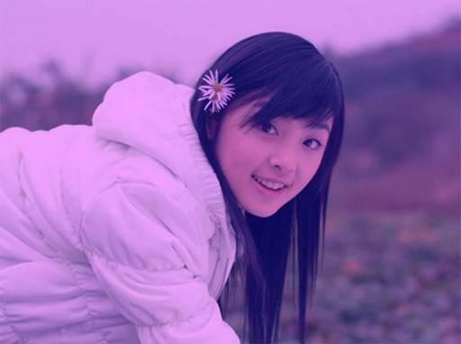

### <a id="blend-darken"></a>Darken

Keeps the darker color of each pixel from the source or backdrop.

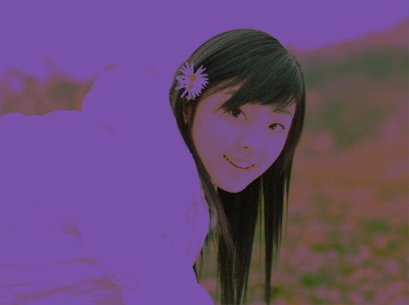

### <a id="blend-lighten"></a>Lighten

Keeps the lighter color of each pixel from the source or backdrop.

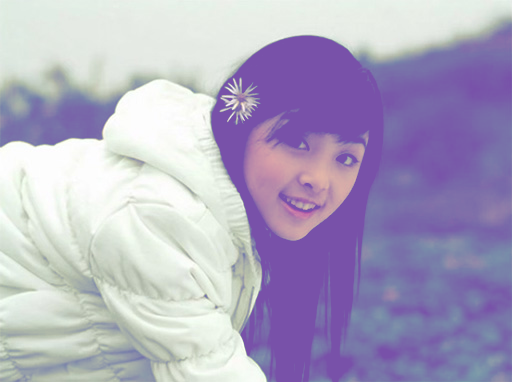

### <a id="blend-color-dodge"></a>Color Dodge

Brightens the backdrop based on the content of the source by dividing by the inverse.

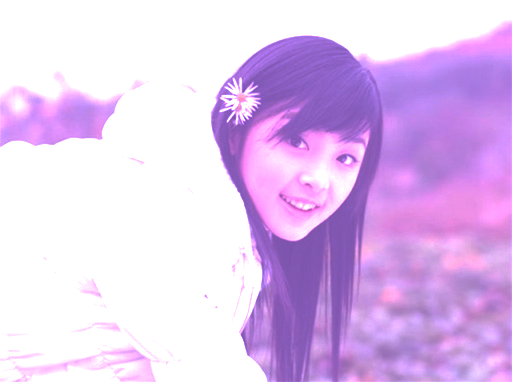

### <a id="blend-color-burn"></a>Color Burn

Darkens the backdrop based on the source by dividing the inverse of the backdrop by the source.

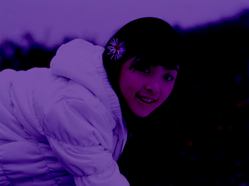

### <a id="blend-hard-light"></a>Hard Light

A strong effect that applies Overlay with the source as the source.

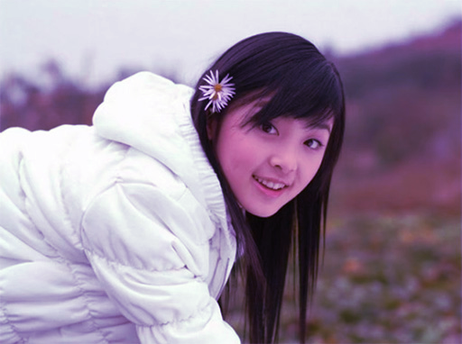

### <a id="blend-soft-light"></a>Soft Light

Gently adjusts contrast based on the source, giving a softer result.


### <a id="blend-difference"></a>Difference

Subtracts the darker color from the lighter one at each pixel.

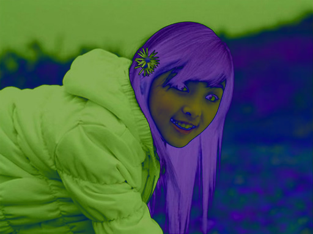

### <a id="blend-exclusion"></a>Exclusion

Similar to Difference, but with reduced contrast and softer transitions.


## Composite

Composites two surfaces using a Porter-Duff compositing operator. The source surface is composited over the backdrop using the specified operator. The result is written to the output.

### <a id="composite-over"></a>Over

Draws the source over the backdrop, preserving transparency. This is the default mode.


### <a id="composite-in"></a>In

Shows the part of the source that overlaps with the backdrop. Everything else is hidden.

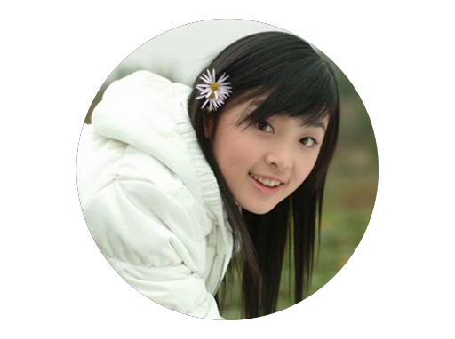

### <a id="composite-out"></a>Out

Shows the part of the source that lies outside the backdrop. Removes overlapping areas.

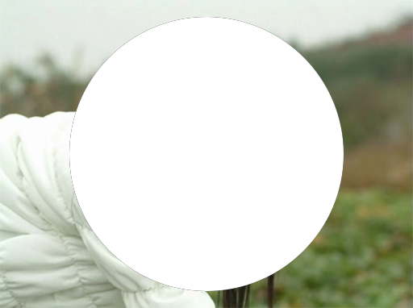

### <a id="composite-atop"></a>Atop

Keeps the overlapping part of the source, but only where the backdrop is present.


### <a id="arithmetic"></a>Arithmetic

Blends two input surfaces using a flexible arithmetic combination of their color values. The output is based on the colors from both inputs, combined according to the four constants: `k1`, `k2`, `k3`, and `k4`.

| Test 1                                                      | Test 2                                                      | Test 3                                                      | Test 4                                                      |
| ----------------------------------------------------------- | ----------------------------------------------------------- | ----------------------------------------------------------- | ----------------------------------------------------------- |
| 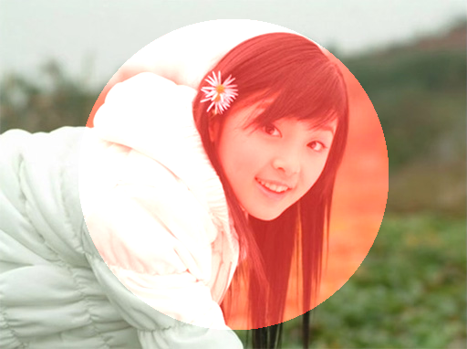 | 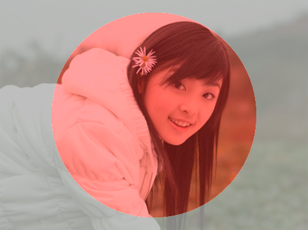 | 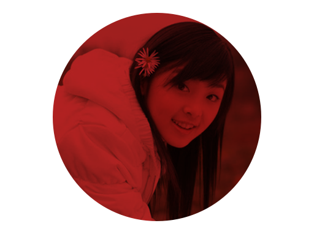 | 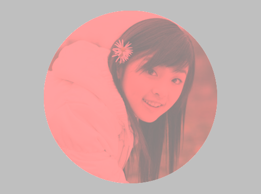 |
