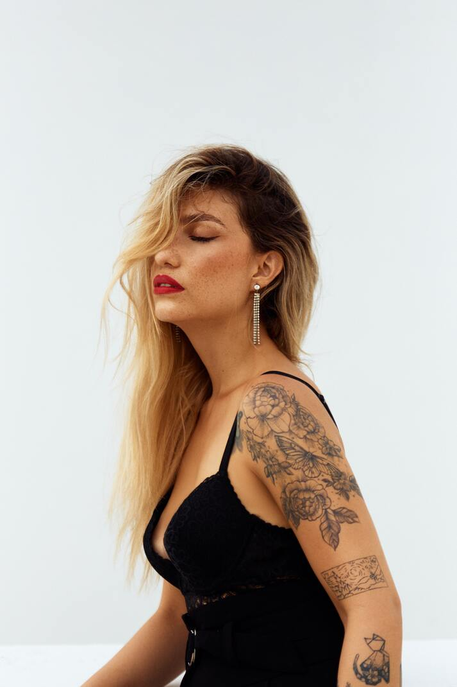
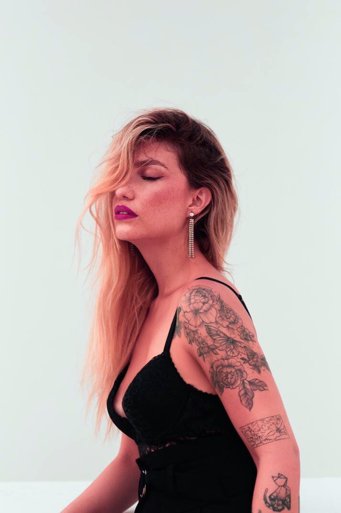

# [PlutoFilter](https://github.com/sammycage/plutofilter) port to rust

PlutoFilter is a zero-allocation image filter library. A Rust port of the original C library that applies fast, chainable image effects without any dynamic memory allocation. Compatible with SVG and CSS filter semantics, it makes it easy to reproduce visual effects consistently across platforms.

## Notice

- This is a personal project to learn rust and in no way production ready yet.

### Whats next

✓ Have a better interface to interact with API. (Design pattern like Builder | Partially Done)

✓ Introduce examples

- Implement bench marks
- Implement SIMD for same operations. (I'm learning to do that)
- Have a small TUI, using which you can just add the image; using a few sliders or something more suitable implement changes.

## Example

```rust
use image::ImageResult;
use plutofilter_rs::{ImageEditor, get_resource_path};

fn main() -> ImageResult<()> {
    let base_file = get_resource_path(&["original_images"], "test-image.jpg");
    let editor = ImageEditor::open(&base_file);
    let output_path = get_resource_path(&["test_output_images", "example"], "test-image.jpg");
    editor
        .color_transform_contrast_inplace(0.97)
        .color_transform_hue_rotate_inplace(330.0)
        .color_transform_saturate_inplace(1.11)
        .save_to(&output_path)
}
```

| `input.jpg`                                                                        | `output.jpg`                                                                                                           |
| ---------------------------------------------------------------------------------- | ---------------------------------------------------------------------------------------------------------------------- |
|  |  |

## Features

- [Gaussian Blur](#gaussian-blur)
- [Color Transform](#color-transform)

  - [Grayscale](#grayscale)
  - [Sepia](#sepia)
  - [Saturate](#saturate)
  - [Brightness](#brightness)
  - [Contrast](#contrast)
  - [Opacity](#opacity)
  - [Invert](#invert)
  - [Hue Rotate](#hue-rotate)

- [Blend](#blend)

  - [Normal](#blend-normal)
  - [Multiply](#blend-multiply)
  - [Screen](#blend-screen)
  - [Overlay](#blend-overlay)
  - [Darken](#blend-darken)
  - [Lighten](#blend-lighten)
  - [Color Dodge](#blend-color-dodge)
  - [Color Burn](#blend-color-burn)
  - [Hard Light](#blend-hard-light)
  - [Soft Light](#blend-soft-light)
  - [Difference](#blend-difference)
  - [Exclusion](#blend-exclusion)

- [Composite](#composite)
  - [Over](#composite-over)
  - [In](#composite-in)
  - [Out](#composite-out)
  - [Atop](#composite-atop)
  - [Arithmetic](#arithmetic)

## Roadmap

- [Morphology](https://www.w3.org/TR/SVG11/filters.html#feMorphologyElement)
- [Diffuse Lighting](https://www.w3.org/TR/SVG11/filters.html#feDiffuseLightingElement)
- [Specular Lighting](https://www.w3.org/TR/SVG11/filters.html#feSpecularLightingElement)
- [Convolve Matrix](https://www.w3.org/TR/SVG11/filters.html#feConvolveMatrixElement)
- [Displacement Map](https://www.w3.org/TR/SVG11/filters.html#feDisplacementMapElement)
- [Turbulence](https://www.w3.org/TR/SVG11/filters.html#feTurbulenceElement)

## Gaussian Blur

Applies a Gaussian blur to the input surface using separable convolution. The amount of blur is controlled by the standard deviation along the horizontal and vertical axes. A value of `0` applies no blur.

| `0x0`                                                                                                              | `5x5`                                                                                                    | `10x10`                                                                                                      |
| ------------------------------------------------------------------------------------------------------------------ | -------------------------------------------------------------------------------------------------------- | ------------------------------------------------------------------------------------------------------------ |
|  |  |  |

## Color Transform

Applies a 5×4 color transformation matrix to each pixel in the input surface. The matrix operates on color and alpha channels, allowing both isolated and cross-channel transformations. The input and output surfaces may be the same for in-place filtering.

### Example

```rust
const ORIGINAL: [f32;20] = [
    1.0, 0.0, 0.0, 0.0, 0.0,
    0.0, 1.0, 0.0, 0.0, 0.0,
    0.0, 0.0, 1.0, 0.0, 0.0,
    0.0, 0.0, 0.0, 1.0, 0.0
];

const GRAYSCALE: [f32;20] = [
    0.2126, 0.7152, 0.0722, 0.0, 0.0,
    0.2126, 0.7152, 0.0722, 0.0, 0.0,
    0.2126, 0.7152, 0.0722, 0.0, 0.0,
    0.0,    0.0,    0.0,    1.0, 0.0
];

const SEPIA: [f32;20] = [
    0.393, 0.769, 0.189, 0.0, 0.0,
    0.349, 0.686, 0.168, 0.0, 0.0,
    0.272, 0.534, 0.131, 0.0, 0.0,
    0.0,   0.0,   0.0,   1.0, 0.0
];

const CONTRAST: [f32;20] = [
    1.75, 0.0,  0.0,  0.0, -0.375,
    0.0,  1.75, 0.0,  0.0, -0.375,
    0.0,  0.0,  1.75, 0.0, -0.375,
    0.0,  0.0,  0.0,  1.0,   0.0
];
```

```rust
use plutofilter_rs::{ImageEditor, get_resource_path};
use image::ImageResult
fn main() -> ImageResult<()> {
    const ORIGINAL: [f32; 20] = [
        1.0, 0.0, 0.0, 0.0, 0.0, 0.0, 1.0, 0.0, 0.0, 0.0, 0.0, 0.0, 1.0, 0.0, 0.0, 0.0, 0.0,
        0.0, 1.0, 0.0,
    ];
    let base_file = get_resource_path(&["original_images"], "zhang-hanyun.jpg");
    let mut editor = ImageEditor::open(base_file);
    editor = editor.color_transform(ORIGINAL);
    let output_path =
        get_resource_path(&["test_output_images", "color_transform"], "original.png");
    editor.save_to(output_path)
}
```

| `original`                                                                                     | `grayscale`                                                                                           | `sepia`                                                                                       | `contrast`                                                                                          |
| ---------------------------------------------------------------------------------------------- | ----------------------------------------------------------------------------------------------------- | --------------------------------------------------------------------------------------------- | --------------------------------------------------------------------------------------------------- |
|  |  |  |  |

### Grayscale

Applies a grayscale effect to the input surface, controlled by a blending `amount` between the original color and fully desaturated grayscale. A value of `0` preserves the original image, while `1` results in complete grayscale.

```rust
use plutofilter_rs::{ImageEditor, get_resource_path};
use image::ImageResult
fn main() -> ImageResult<()> {
    let base_file = "input.png";
    let mut editor = ImageEditor::open(base_file);
    editor = editor.color_transform_grayscale(0.25);
    let output_path = "output.png";
    editor.save_to(output_path)
}
```

| `0`                                                                                               | `0.25`                                                                                                   | `0.5`                                                                                                   | `0.75`                                                                                                   | `1`                                                                                              |
| ------------------------------------------------------------------------------------------------- | -------------------------------------------------------------------------------------------------------- | ------------------------------------------------------------------------------------------------------- | -------------------------------------------------------------------------------------------------------- | ------------------------------------------------------------------------------------------------ |
|  |  |  |  |  |

### Sepia

Applies a sepia tone to the input surface, blending between the original image and a warm, brownish tone. The `amount` controls the intensity, where `0` leaves the image unchanged and `1` applies full sepia coloration.

```rust
use plutofilter_rs::{ImageEditor, get_resource_path};
use image::ImageResult
fn main() -> ImageResult<()> {
    let base_file = "input.png";
    let mut editor = ImageEditor::open(base_file);
    editor = editor.color_transform_sepia(0.25);
    let output_path = "output.png";
    editor.save_to(output_path)
}
```

| `0`                                                                                       | `0.25`                                                                                       | `0.5`                                                                                       | `0.75`                                                                                       | `1`                                                                                       |
| ----------------------------------------------------------------------------------------- | -------------------------------------------------------------------------------------------- | ------------------------------------------------------------------------------------------- | -------------------------------------------------------------------------------------------- | ----------------------------------------------------------------------------------------- |
|  |  |  |  |  |

### Saturate

Adjusts the color saturation of the input surface. The `amount` controls how vivid or muted the colors become: `1` leaves the image unchanged, values less than `1` reduce saturation toward grayscale, and values greater than `1` enhance the intensity of colors.

```rust
use plutofilter_rs::{ImageEditor, get_resource_path};
use image::ImageResult
fn main() -> ImageResult<()> {
    let base_file = "input.png";
    let mut editor = ImageEditor::open(base_file);
    editor = editor.color_transform_saturate(0.25);
    let output_path = "output.png";
    editor.save_to(output_path)
}
```

| `0`                                                                                                      | `0.5`                                                                                              | `1`                                                                                                 | `4`                                                                                                    |
| -------------------------------------------------------------------------------------------------------- | -------------------------------------------------------------------------------------------------- | --------------------------------------------------------------------------------------------------- | ------------------------------------------------------------------------------------------------------ |
|  |  |  |  |

### Contrast

Adjusts the contrast of the input surface. An `amount` of `1` leaves the image unchanged, values below `1` reduce contrast, and values above `1` increase it. The image is scaled around the midpoint of the color range.

```rust
use plutofilter_rs::{ImageEditor, get_resource_path};
use image::ImageResult
fn main() -> ImageResult<()> {
    let base_file = "input.png";
    let mut editor = ImageEditor::open(base_file);
    editor = editor.color_transform_contrast(0.25);
    let output_path = "output.png";
    editor.save_to(output_path)
}
```

| `0`                                                                                                      | `1`                                                                                               | `1.75`                                                                                                      |
| -------------------------------------------------------------------------------------------------------- | ------------------------------------------------------------------------------------------------- | ----------------------------------------------------------------------------------------------------------- |
|  |  |  |

### Brightness

Adjusts the brightness of the input surface. An `amount` of `1` preserves the original brightness, values below `1` darken the image, and values above `1` brighten it uniformly across all color channels.

```rust
use plutofilter_rs::{ImageEditor, get_resource_path};
use image::ImageResult
fn main() -> ImageResult<()> {
    let base_file = "input.png";
    let mut editor = ImageEditor::open(base_file);
    editor = editor.color_transform_brightness(0.25);
    let output_path = "output.png";
    editor.save_to(output_path)
}
```

| `0`                                                                                                 | `0.5`                                                                                              | `1`                                                                                                     | `1.75`                                                                                                            |
| --------------------------------------------------------------------------------------------------- | -------------------------------------------------------------------------------------------------- | ------------------------------------------------------------------------------------------------------- | ----------------------------------------------------------------------------------------------------------------- |
|  |  |  |  |

### Opacity

Adjusts the opacity (alpha) of the input surface. An `amount` of `1` leaves opacity unchanged, while values between `0` and `1` scale the alpha channel linearly. A value of `0` makes the image fully transparent.

```rust
use plutofilter_rs::{ImageEditor, get_resource_path};
use image::ImageResult
fn main() -> ImageResult<()> {
    let base_file = "input.png";
    let mut editor = ImageEditor::open(base_file);
    editor = editor.color_transform_opacity(0.25);
    let output_path = "output.png";
    editor.save_to(output_path)
}
```

| `0`                                                                                             | `0.25`                                                                                       | `0.5`                                                                                       | `0.75`                                                                                       | `1`                                                                                        |
| ----------------------------------------------------------------------------------------------- | -------------------------------------------------------------------------------------------- | ------------------------------------------------------------------------------------------- | -------------------------------------------------------------------------------------------- | ------------------------------------------------------------------------------------------ |
|  |  |  |  |  |

### Invert

Applies a color inversion effect to the input surface. The `amount` controls the strength of the inversion: `0` leaves the image unchanged, `1` fully inverts the RGB channels, and intermediate values blend between the original and inverted colors.

```rust
use plutofilter_rs::{ImageEditor, get_resource_path};
use image::ImageResult
fn main() -> ImageResult<()> {
    let base_file = "input.png";
    let mut editor = ImageEditor::open(base_file);
    editor = editor.color_transform_invert(0.25);
    let output_path = "output.png";
    editor.save_to(output_path)
}
```

| `0`                                                                                         | `0.25`                                                                                       | `0.5`                                                                                       | `0.75`                                                                                       | `1`                                                                                               |
| ------------------------------------------------------------------------------------------- | -------------------------------------------------------------------------------------------- | ------------------------------------------------------------------------------------------- | -------------------------------------------------------------------------------------------- | ------------------------------------------------------------------------------------------------- |
|  |  |  |  |  |

### Hue Rotate

Rotates the hue of each pixel in the input surface by the given angle in degrees. The rotation is applied in the RGB color space, preserving luminance and alpha. A value of `0` leaves colors unchanged, while `360` completes a full rotation back to the original.

```rust
use plutofilter_rs::{ImageEditor, get_resource_path};
use image::ImageResult
fn main() -> ImageResult<()> {
    let base_file = "input.png";
    let mut editor = ImageEditor::open(base_file);
    editor = editor.color_transform_hue_rotate(180.0);
    let output_path = "output.png";
    editor.save_to(output_path)
}
```

| `0°`                                                                                               | `30°`                                                                               | `90°`                                                                               | `180°`                                                                                               | `270°`                                                                               | `360°`                                                                                                  |
| -------------------------------------------------------------------------------------------------- | ----------------------------------------------------------------------------------- | ----------------------------------------------------------------------------------- | ---------------------------------------------------------------------------------------------------- | ------------------------------------------------------------------------------------ | ------------------------------------------------------------------------------------------------------- |
|  |  |  |  |  |  |

## Blend

Blends two surfaces using the specified blend mode. The source surface is blended over the backdrop, and the result is written to the output.

```rust
use plutofilter_rs::{ImageEditor, get_resource_path, BlendMode};
use image::ImageResult
fn main() -> ImageResult<()> {
    let base_file = "input.png";
    let blend_image = "blend.png";
    let mut editor = ImageEditor::open(base_file);
    editor = editor.blend(blend_image, BlendMode::Normal);
    let output_path = "output.png";
    editor.save_to(output_path)
}
```

| Mode                                      | Description                                                                                     | Preview                                                                        |
| ----------------------------------------- | ----------------------------------------------------------------------------------------------- | ------------------------------------------------------------------------------ |
| <a id="blend-normal"></a>Normal           | Displays the source over the backdrop using standard alpha compositing.                         |            |
| <a id="blend-multiply"></a>Multiply       | Multiplies the colors of the source and backdrop, resulting in a darker image.                  |        |
| <a id="blend-screen"></a>Screen           | Brightens the result by inverting, multiplying, and inverting again.                            |            |
| <a id="blend-overlay"></a>Overlay         | Applies Multiply on dark areas and Screen on light areas to add contrast.                       |          |
| <a id="blend-darken"></a>Darken           | Keeps the darker color of each pixel from the source or backdrop.                               |            |
| <a id="blend-lighten"></a>Lighten         | Keeps the lighter color of each pixel from the source or backdrop.                              |          |
| <a id="blend-color-dodge"></a>Color Dodge | Brightens the backdrop based on the content of the source by dividing by the inverse.           |  |
| <a id="blend-color-burn"></a>Color Burn   | Darkens the backdrop based on the source by dividing the inverse of the backdrop by the source. |    |
| <a id="blend-hard-light"></a>Hard Light   | A strong effect that applies Overlay with the source as the source.                             |    |
| <a id="blend-soft-light"></a>Soft Light   | Gently adjusts contrast based on the source, giving a softer result.                            |    |
| <a id="blend-difference"></a>Difference   | Subtracts the darker color from the lighter one at each pixel.                                  |    |
| <a id="blend-exclusion"></a>Exclusion     | Similar to Difference, but with reduced contrast and softer transitions.                        |      |

## Composite

```rust
use plutofilter_rs::{CompositeOperator, ImageEditor, get_resource_path};
use image::ImageResult
fn main() -> ImageResult<()> {
    let base_file = "input.png";
    let composite_image = "composite.png";
    let mut editor = ImageEditor::open(base_file);
    editor = editor.composite(composite_image, CompositeOperator::In);
    let output_path = "output.png";
    editor.save_to(output_path)
}
```

Composites two surfaces using a Porter-Duff compositing operator. The source surface is composited over the backdrop using the specified operator. The result is written to the output.

| Operator                        | Description                                                                              | Preview                                                                      |
| ------------------------------- | ---------------------------------------------------------------------------------------- | ---------------------------------------------------------------------------- |
| <a id="composite-over"></a>Over | Draws the source over the backdrop, preserving transparency. This is the default mode.   |  |
| <a id="composite-in"></a>In     | Shows the part of the source that overlaps with the backdrop. Everything else is hidden. |      |
| <a id="composite-out"></a>Out   | Shows the part of the source that lies outside the backdrop. Removes overlapping areas.  |    |
| <a id="composite-atop"></a>Atop | Keeps the overlapping part of the source, but only where the backdrop is present.        |  |

### <a id="arithmetic"></a>Arithmetic

Blends two input surfaces using a flexible arithmetic combination of their color values. The output is based on the colors from both inputs, combined according to the four constants: `k1`, `k2`, `k3`, and `k4`.

```rust
use plutofilter_rs::{ImageEditor, get_resource_path};
use image::ImageResult
fn main() -> ImageResult<()> {
    let base_file = "input.png";
    let composite_image = "composite.png";
    let mut editor = ImageEditor::open(base_file);
    editor = editor.composite_arithmatic(composite_image, 0.0, 1.0, 0.0, 1.0);
    let output_path = "output.png";
    editor.save_to(output_path)
}
```

| Test 1                                                                                        | Test 2                                                                                        | Test 3                                                                                        | Test 4                                                                                        |
| --------------------------------------------------------------------------------------------- | --------------------------------------------------------------------------------------------- | --------------------------------------------------------------------------------------------- | --------------------------------------------------------------------------------------------- |
|  |  |  |  |
